01 October, 2021

-   [Required Packages](#required-packages)
-   [API Interaction Functions](#api-interaction-functions)
    -   [`countyList()`](#countylist)
    -   [`countrySlugAbbrev()`](#countryslugabbrev)
    -   [`firstCase()`](#firstcase)
    -   [`casesCountryTime()`](#casescountrytime)
    -   [`variableCountryTime()`](#variablecountrytime)
    -   [`compareCountries()`](#comparecountries)
    -   [`countryData()`](#countrydata)
-   [Data Manipulation](#data-manipulation)
-   [Exploratory Data Analysis](#exploratory-data-analysis)
    -   [Contingency Tables](#contingency-tables)
    -   [Numerical Summaries](#numerical-summaries)
    -   [Bar plots](#bar-plots)
    -   [Histograms](#histograms)
    -   [Box plots](#box-plots)
    -   [Scatterplots with Line Graphs](#scatterplots-with-line-graphs)
-   [Summary](#summary)

This vignette aims to demonstrate how to access data from an API
particularly the [Covid-19 API](https://covid19api.com). This will
showcase different packages and functions to manipulate generated data
set, apply exploratory analysis and present results using tables and
plots. The vignette will focus on comparing Philippines’ Covid-19 data
to neighboring countries with similar land area, demographics and
population.

# Required Packages

In this project, we will use a number of amazing R packages:

-   [`knitr`](https://bookdown.org/yihui/rmarkdown-cookbook/kable.html):
    to generate pretty tables of data using the `kable()` function.  
-   [`tidyverse`](https://www.tidyverse.org/): to manipulate data,
    generate plots (via `ggplot2`), and to use piping/chaining.
-   [`rmarkdown`](https://rmarkdown.rstudio.com/): to knit output files
    manually using the `render()` function.  
-   [`jsonlite`](https://cran.r-project.org/web/packages/jsonlite/index.html):
    to pull data from various endpoints of the Covid 19 APIs.  
-   [`httr`](https://httr.r-lib.org/articles/api-packages.html): to make
    computer and API communicate with each other.

To be able to use the packages mentioned above, we need to load them
using the `library()` function.

# API Interaction Functions

In order to make our computer communicate with the Covid-19 API, we need
to create different functions that will generate the data set or
information that we want.

## `countyList()`

This function is important because this will generate a list of
countries that have information about Covid-19. This will also generate
a corresponding country slug name which will be used in the succeeding
functions. No argument is needed to run this function.

``` r
#create countryList function
countryList <- function(){
  covid <- GET("https://api.covid19api.com/countries")
  covidDF <- fromJSON(rawToChar(covid$content))
  countryList <- covidDF %>% as_tibble()
  return(countryList)
}
#run function and save it to an R object
countryList <- countryList()
#show the first few rows of the data set
head(countryList)
```

    ## # A tibble: 6 x 3
    ##   Country                  Slug                     ISO2 
    ##   <chr>                    <chr>                    <chr>
    ## 1 Poland                   poland                   PL   
    ## 2 Comoros                  comoros                  KM   
    ## 3 Djibouti                 djibouti                 DJ   
    ## 4 Turks and Caicos Islands turks-and-caicos-islands TC   
    ## 5 Bulgaria                 bulgaria                 BG   
    ## 6 Honduras                 honduras                 HN

## `countrySlugAbbrev()`

Accessing a data set of a specific country would need the use of the
country’s slug name as an argument of the function. This function
specifically returns the corresponding slug name of the country being
passed as an argument. An error message will appear if the name of the
country is misspeled, first letter is not capitalized or if it can’t be
found in the data set.

``` r
#create the function
countrySlugAbbrev <- function(inputCountry){
  if (inputCountry %in% countryList$Country){
      covidData <- GET("https://api.covid19api.com/countries")
      covidDF <- fromJSON(rawToChar(covidData$content))
      dataTibble <- covidDF %>% filter(Country == inputCountry ) %>% as_tibble()
  } else {
    message <- paste("ERROR: Argument for country cannot be found, check spelling.
                     Lastly, use quotation marks in your arguments.")
    stop(message)
  }
  return(dataTibble)
}
#try-out the function
countrySlugAbbrev("United States of America")
```

    ## # A tibble: 1 x 3
    ##   Country                  Slug          ISO2 
    ##   <chr>                    <chr>         <chr>
    ## 1 United States of America united-states US

The results above suggest that if we want to access Covid-19 information
about the United States of America, we will have to use the slug name
“united-states”.

## `firstCase()`

This function will generate the day of the first confirmed case/s of
Covid-19 of the country specified. The use of the country’s slug name
with quotation marks is important for the function to work. Use
`countrySlugAbbrev()` function to generate the slug name of the country
you want. An error message will show up if these conditions are not met.

``` r
#create function
firstCase <- function(countrySlug){
  if (countrySlug %in% countryList$Slug){
      url <- paste0("https://api.covid19api.com/dayone/country/",countrySlug,"/status/confirmed")
      covidData <- GET(url)
      covidDF <- fromJSON(rawToChar(covidData$content))
      dataTibble <- covidDF %>% select(Country, Cases, Status, Date) %>% as_tibble()
  } else {
    message <- paste("ERROR: Argument for country nslug cannot be found, check spelling.
                     Lastly, use quotation marks in your arguments.")
    stop(message)
  }
  return(dataTibble[1,])
}
#try-out function passing "philippines" as the slug name.
firstCase("philippines")
```

    ## # A tibble: 1 x 4
    ##   Country     Cases Status    Date                
    ##   <chr>       <int> <chr>     <chr>               
    ## 1 Philippines     1 confirmed 2020-01-30T00:00:00Z

The results tell us that last 30th of January 2020, the Philippines
recorded its first confirmed case of Covid-19.

## `casesCountryTime()`

This function will generate the cumulative number of confirmed cases of
a particular country in a specific period of time. The user needs to
pass 3 arguments such as country’s slug name, start and end dates in
2021-09-01 format. All arguments need to be enclosed with quotation
marks. The function has the capability to detect incorrect format,
unknown argument and etc.

``` r
#create function
casesCountryTime <- function(countrySlug, startDate, endDate){
  if (countrySlug %in% countryList$Slug){
      url <- paste0("https://api.covid19api.com/total/country/",countrySlug,
                    "/status/confirmed?from=",startDate,"T00:00:00Z&to=",endDate,"T00:00:00Z")
      covidData <- GET(url)
      covidDF <- fromJSON(rawToChar(covidData$content))
      dataTibble <- covidDF %>% select(Country, Cases, Status, Date) %>% as_tibble()
  } else {
    message <- paste("ERROR: Argument for country slug may not be found, check the list of 
                      countries with its corresponding slug name. Start and end dates are might
                      have formatted incorrectly. Lastly, use quotation marks in your arguments.")
    stop(message)
  }
  return(dataTibble)
}
#try-out function
philSept <- casesCountryTime("philippines","2021-09-01", "2021-09-30")
#show only the first few rows of the data set
head(philSept)
```

    ## # A tibble: 6 x 4
    ##   Country       Cases Status    Date                
    ##   <chr>         <int> <chr>     <chr>               
    ## 1 Philippines 2003955 confirmed 2021-09-01T00:00:00Z
    ## 2 Philippines 2020484 confirmed 2021-09-02T00:00:00Z
    ## 3 Philippines 2040568 confirmed 2021-09-03T00:00:00Z
    ## 4 Philippines 2061084 confirmed 2021-09-04T00:00:00Z
    ## 5 Philippines 2080984 confirmed 2021-09-05T00:00:00Z
    ## 6 Philippines 2103331 confirmed 2021-09-06T00:00:00Z

The results above show the cumulative confirmed cases of the Philippines
for the month of September.

## `variableCountryTime()`

This function will access a specific type of information that we want to
access. The user has to pass the country’s slug name, start and end date
and the type of data to generate such as cumulative confirmed cases or
“Confirmed”, cumulative new deaths or “Deaths”, daily recovered patients
or “Recovered”, and number of active cases or “Active”. Again, all
arguments have to be enclosed with quotation marks. Similar to the
previous functions, this function has the capability to detect incorrect
format, unknown argument and etc.

``` r
#create function
variableCountryTime <- function(countrySlug, startDate, endDate, type){
  if (countrySlug %in% countryList$Slug){
      url <- paste0("https://api.covid19api.com/country/",countrySlug,
                    "?from=",startDate,"T00:00:00Z&to=",endDate,"T00:00:00Z")
      covidData <- GET(url)
      covidDF <- fromJSON(rawToChar(covidData$content))
      dataTibble <- covidDF %>% select(Country, type, Date) %>% as_tibble()
  } else {
    message <- paste("ERROR: Argument for country slug may not be found, check the list of 
                      countries with its corresponding slug name. Start and end dates 
                      are might have formatted incorrectly. Lastly, use quotation marks in your arguments.")
    stop(message)
  }
  return(dataTibble)
}
#try-out function
philSept <- variableCountryTime("philippines","2021-09-26", "2021-10-02", "Deaths")
#show generated data set
philSept
```

    ## # A tibble: 7 x 3
    ##   Country     Deaths Date                
    ##   <chr>        <int> <chr>               
    ## 1 Philippines  37405 2021-09-26T00:00:00Z
    ## 2 Philippines  37405 2021-09-27T00:00:00Z
    ## 3 Philippines  37596 2021-09-28T00:00:00Z
    ## 4 Philippines  38164 2021-09-29T00:00:00Z
    ## 5 Philippines  38294 2021-09-30T00:00:00Z
    ## 6 Philippines  38493 2021-10-01T00:00:00Z
    ## 7 Philippines  38656 2021-10-02T00:00:00Z

The results above show the cumulative number of deaths in the
Philippines from Sept 26, 2021 to October 2, 2021.

## `compareCountries()`

This function will generate the current date’s Covid-19 information of
five different countries. The user needs to supply the country names as
arguments (first letter capitalized) and a summary of today’s confirmed
new cases, total confirmed cases, new deaths and total deaths will be
generated. The function is capable of detecting incorrect format and if
quotation marks are not used.

``` r
#create function
compareCountries <- function(country1, country2, country3, country4, country5){
  covid <- GET("https://api.covid19api.com/summary")
  covidDF <- fromJSON(rawToChar(covid$content))
  data <- covidDF$Countries %>% as_tibble()
  countries <- c(country1, country2, country3, country4, country5)
  finalData <- data.frame(matrix(ncol=6,nrow=0))
  names(finalData) <- c("Country","NewConfirmed","TotalConfirmed","NewDeaths","TotalDeaths","Date")
  for (country in countries){
    if (country %in% data$Country){
      finalData[nrow(finalData)+1, ] <- data %>% filter(data$Country == country) %>% 
        select(c(Country,NewConfirmed,TotalConfirmed,NewDeaths,TotalDeaths,Date))
    }
    else{
      message <- paste("ERROR: Check spelling of countries supplied or use quotation marks.")
      stop(message)
    }
  }
  return(finalData %>% as_tibble())
}  
#try-out function  
compareCountries("Philippines","China", "Mexico", "United States of America", "Canada")
```

    ## # A tibble: 5 x 6
    ##   Country                  NewConfirmed TotalConfirmed NewDeaths TotalDeaths Date                    
    ##   <chr>                           <int>          <int>     <int>       <int> <chr>                   
    ## 1 Philippines                         0        2580173         0       38656 2021-10-03T22:46:19.746Z
    ## 2 China                              33         108528         0        4849 2021-10-03T22:46:19.746Z
    ## 3 Mexico                           7369        3678980       614      278592 2021-10-03T22:46:19.746Z
    ## 4 United States of America        39206       43657833       647      700932 2021-10-03T22:46:19.746Z
    ## 5 Canada                           1728        1339341        22       25264 2021-10-03T22:46:19.746Z

The results above show the latest information, in this case October 3,
2021, of five different countries. This information changes when
Covid-19 API updates its database and the user re-runs the function.

## `countryData()`

This function will generate all data (daily new cases, new deaths,
active cases and recovered patients) of a particular country since the
start of the pandemic. The user needs to supply the slug name of the
country in quotes.

``` r
#create function
countryData <- function(countrySlug){
  if (countrySlug %in% countryList$Slug){
      url <- paste0("https://api.covid19api.com/total/country/",countrySlug)
      covidData <- GET(url)
      covidDF <- fromJSON(rawToChar(covidData$content))
      dataTibble <- covidDF %>% as_tibble()
  } else {
    message <- paste("ERROR: Argument for country slug is not found.
                     Check the list of countries with its corresponding slug name
                     and use quotation marks.")
    stop(message)
  }
  return(dataTibble)
}
#try-out the function
covidUS <- countryData("united-states")
#show the last few rows of the function
tail(covidUS)
```

    ## # A tibble: 6 x 12
    ##   Country                  CountryCode Province City  CityCode Lat   Lon   Confirmed Deaths Recovered   Active Date               
    ##   <chr>                    <chr>       <chr>    <chr> <chr>    <chr> <chr>     <int>  <int>     <int>    <int> <chr>              
    ## 1 United States of America ""          ""       ""    ""       0     0      43116877 690435         0 42426006 2021-09-27T00:00:0…
    ## 2 United States of America ""          ""       ""    ""       0     0      43226482 692592         0 42534635 2021-09-28T00:00:0…
    ## 3 United States of America ""          ""       ""    ""       0     0      43349749 695123         0 42654075 2021-09-29T00:00:0…
    ## 4 United States of America ""          ""       ""    ""       0     0      43460343 697851         0 42761967 2021-09-30T00:00:0…
    ## 5 United States of America ""          ""       ""    ""       0     0      43618627 700285         0 42918342 2021-10-01T00:00:0…
    ## 6 United States of America ""          ""       ""    ""       0     0      43657833 700932         0 42956901 2021-10-02T00:00:0…

# Data Manipulation

As mentioned above, this vignette focuses on comparing Covid-19
information of the Philippines to two other neighboring countries
namely: Indonesia and Bangladesh. To start, we will use the
`contryData()` function to generate all Covid-19 information for each
country, then we will manipulate the generated data set and combine all
three of them to one big data set for exploration and analysis.

``` r
#use countryData() function to generate Covid-19 information for each country
covidInd <- countryData("indonesia")
covidBang <- countryData("bangladesh")
covidPhil <- countryData("philippines")
```

Now that we have the information for each country, let’s manipulate the
data set by selecting only the variables that we need and creating new
variables that are necessary for our analysis. Since the free version of
the API only provided cumulative number of confirmed cases and deaths,
we can create two variables such as daily new cases and daily new deaths
by subtracting two consecutive days. We can convert the string “Date”
variable to a date type of object so that we can perform date
operations. We can also separate the string “Date” variable to day,
month and year which will come handy when we want to filter our data
set. After that, we are then ready to bind them together to create one
big data set ready for analysis.

``` r
#manipulate Indonesia's data set
covidInd <- covidInd %>% 
    mutate("NewCases"=diff(c(0, Confirmed)), "NewDeaths"=diff(c(0, Deaths)),"Date"=as.Date(Date)) %>%
            separate(Date, c("Year", "Month", "Day"), sep="-", convert=T, remove=F) 

#manipulate Bangladesh's data set
covidBang <- covidBang %>% 
    mutate("NewCases"=diff(c(0, Confirmed)), "NewDeaths"=diff(c(0, Deaths)),"Date"=as.Date(Date)) %>%
            separate(Date, c("Year", "Month", "Day"), sep="-", convert=T, remove=F) 

#manipulate Philippines' data set
covidPhil <- covidPhil %>% 
    mutate("NewCases"=diff(c(0, Confirmed)), "NewDeaths"=diff(c(0, Deaths)),"Date"=as.Date(Date)) %>%
            separate(Date, c("Year", "Month", "Day"), sep="-", convert=T, remove=F) 

#now we can put them all together in one data set for data exploration and analysis
dataset <- bind_rows(covidBang, covidInd, covidPhil)
dataset <- dataset %>% select(Country, Confirmed, Deaths, Recovered, Active, Date, Year, Month, Day, NewCases, NewDeaths)
dataset$Country <- as.factor(dataset$Country)

#show first few rows of the big data set
head(dataset)
```

    ## # A tibble: 6 x 11
    ##   Country    Confirmed Deaths Recovered Active Date        Year Month   Day NewCases NewDeaths
    ##   <fct>          <int>  <int>     <int>  <int> <date>     <int> <int> <int>    <dbl>     <dbl>
    ## 1 Bangladesh         0      0         0      0 2020-01-22  2020     1    22        0         0
    ## 2 Bangladesh         0      0         0      0 2020-01-23  2020     1    23        0         0
    ## 3 Bangladesh         0      0         0      0 2020-01-24  2020     1    24        0         0
    ## 4 Bangladesh         0      0         0      0 2020-01-25  2020     1    25        0         0
    ## 5 Bangladesh         0      0         0      0 2020-01-26  2020     1    26        0         0
    ## 6 Bangladesh         0      0         0      0 2020-01-27  2020     1    27        0         0

# Exploratory Data Analysis

## Contingency Tables

The first exploratory analysis that we will use is the contingency
table. We can show through tables different counts of different
variables in specific range of time. For consistency, we will use the
three variables new cases, new deaths and active cases for our table. We
will apply these variables to the Philippines’ Covid information from
the 24th to 30th of September.

``` r
#prepare new cases contingency table
dataCont <- dataset %>% filter(Country== "Philippines", Year==2021, Month==9, Day>=24 & Day <= 30) %>%
  select(Date, NewCases)
#use kable to present table in a nicer way
kable(dataCont, caption="Philippines' 7-day Contingency Table of New Cases")
```

| Date       | NewCases |
|:-----------|---------:|
| 2021-09-24 |    18575 |
| 2021-09-25 |    16847 |
| 2021-09-26 |    20683 |
| 2021-09-27 |        0 |
| 2021-09-28 |    18319 |
| 2021-09-29 |    26555 |
| 2021-09-30 |    14234 |

Philippines’ 7-day Contingency Table of New Cases

``` r
#prepare new deaths contingency table
dataCont <- dataset %>% filter(Country== "Philippines", Year==2021, Month==9, Day>=24 & Day <= 30) %>%
  select(Date, NewDeaths)
#use kable to present table in a nicer way
kable(dataCont, caption="Philippines' 7-day Contingency Table of New Deaths")
```

| Date       | NewDeaths |
|:-----------|----------:|
| 2021-09-24 |         0 |
| 2021-09-25 |         0 |
| 2021-09-26 |         0 |
| 2021-09-27 |         0 |
| 2021-09-28 |       191 |
| 2021-09-29 |       568 |
| 2021-09-30 |       130 |

Philippines’ 7-day Contingency Table of New Deaths

``` r
#prepare active cases contingency table
dataCont <- dataset %>% filter(Country== "Philippines", Year==2021, Month==9, Day>=24 & Day <= 30) %>%
  select(Date, Active)
#use kable to present table in a nicer way
kable(dataCont, caption="Philippines' 7-day Contingency Table of Active Cases")
```

| Date       |  Active |
|:-----------|--------:|
| 2021-09-24 | 2415923 |
| 2021-09-25 | 2432770 |
| 2021-09-26 | 2453453 |
| 2021-09-27 | 2453453 |
| 2021-09-28 | 2471581 |
| 2021-09-29 | 2497568 |
| 2021-09-30 | 2511672 |

Philippines’ 7-day Contingency Table of Active Cases

## Numerical Summaries

The next exploratory analysis that we will do is the use of numerical
summaries. These summaries will describe characteristics about a
variable such as where the center is located or how spread the values
are. We will use mean, median, standard deviation, 1st quantile, 3rd
quantile, inter-quantile range and maximum to compare the Philippines’
Covid information to other countries in terms of new cases, new deaths
and active cases since the start to other countries since the start of
the pandemic.

``` r
#daily new cases since the start of pandemic
dataNumSum <- dataset %>% group_by(Country)  %>% 
  summarise(Mean=mean(NewCases), Median=median(NewCases), SD=sd(NewCases), 
             Q1=quantile(NewCases, 0.25, na.rm=T), Q3=quantile(NewCases, 0.75, na.rm=T), 
              IQR=IQR(NewCases,na.rm=T), Maximum=max(NewCases))
#use kable to present table in a nicer way
kable(dataNumSum, caption="Numerical Summaries of Daily Covid Cases since the Start of Pandemic")
```

| Country     |     Mean | Median |       SD |      Q1 |      Q3 |     IQR | Maximum |
|:------------|---------:|-------:|---------:|--------:|--------:|--------:|--------:|
| Bangladesh  | 2511.850 | 1670.5 | 2971.046 |  662.75 | 2964.25 | 2301.50 |   16230 |
| Indonesia   | 6803.455 | 4173.5 | 9694.461 | 1193.00 | 6830.75 | 5637.75 |   56757 |
| Philippines | 4137.882 | 2069.0 | 4998.136 |  737.50 | 5877.75 | 5140.25 |   27887 |

Numerical Summaries of Daily Covid Cases since the Start of Pandemic

``` r
#daily new deaths since the start of pandemic
dataNumSum <- dataset %>% group_by(Country)  %>% 
  summarise(Mean=mean(NewDeaths), Median=median(NewDeaths), SD=sd(NewDeaths), 
             Q1=quantile(NewDeaths, 0.25, na.rm=T), Q3=quantile(NewDeaths, 0.75, na.rm=T), 
                IQR=IQR(NewDeaths, na.rm=T), Maximum=max(NewDeaths))
#use kable to present table in a nicer way
kable(dataNumSum, caption="Numerical Summaries of New Deaths since the Start of Pandemic")
```

| Country     |      Mean | Median |        SD |    Q1 |     Q3 |    IQR | Maximum |
|:------------|----------:|-------:|----------:|------:|-------:|-------:|--------:|
| Bangladesh  |  44.44355 |   30.0 |  55.18313 | 14.00 |  44.25 |  30.25 |     264 |
| Indonesia   | 229.21774 |  116.5 | 367.00349 | 49.75 | 196.25 | 146.50 |    2069 |
| Philippines |  62.08548 |   35.5 |  72.20077 |  9.75 |  94.00 |  84.25 |     568 |

Numerical Summaries of New Deaths since the Start of Pandemic

``` r
#active cases since the start of pandemic
dataNumSum <- dataset %>% group_by(Country)  %>% 
  summarise(Mean=mean(Active), Median=median(Active), SD=sd(Active), 
             Q1=quantile(Active, 0.25, na.rm=T), Q3=quantile(Active, 0.75, na.rm=T), 
                IQR=IQR(Active, na.rm=T), Maximum=max(Active))
#use kable to present table in a nicer way
kable(dataNumSum, caption="Numerical Summaries of Active Cases since the Start of Pandemic")
```

| Country     |     Mean | Median |        SD |       Q1 |        Q3 |       IQR | Maximum |
|:------------|---------:|-------:|----------:|---------:|----------:|----------:|--------:|
| Bangladesh  | 191805.9 |  63539 |  414217.4 | 41052.00 |  92209.75 |  51157.75 | 1529792 |
| Indonesia   | 455215.1 |  67678 | 1127805.6 | 27033.00 | 144432.75 | 117399.75 | 4076027 |
| Philippines | 229396.7 |  38884 |  594104.6 | 21326.25 |  59582.00 |  38255.75 | 2541517 |

Numerical Summaries of Active Cases since the Start of Pandemic

Among the three countries, the Philippines consistently rank the second
highest next to Indonesia in all numerical summaries and across all
three variables.

## Bar plots

For our bar plots example, we will use the October 1, 2021 data of the
five countries. The use of bar plots help us show comparison between
categories of data. In the example below, we will still use the three
variables new cases, new deaths and active cases.

``` r
#set how plots will be arranged in the output
par(mfrow=c(1,3))

#barplot for new cases
dataBarPlot <- dataset %>% filter(Year==2020, Month==10, Day==1)
ggplot(dataBarPlot, aes(Country, NewCases)) + geom_col(fill="Blue", alpha=0.5) + 
  labs(x="Country", y="Confirmed Cases", title="Confirmed New Covid Cases for October 1, 2021") +
    geom_text(aes(label=NewCases))
```

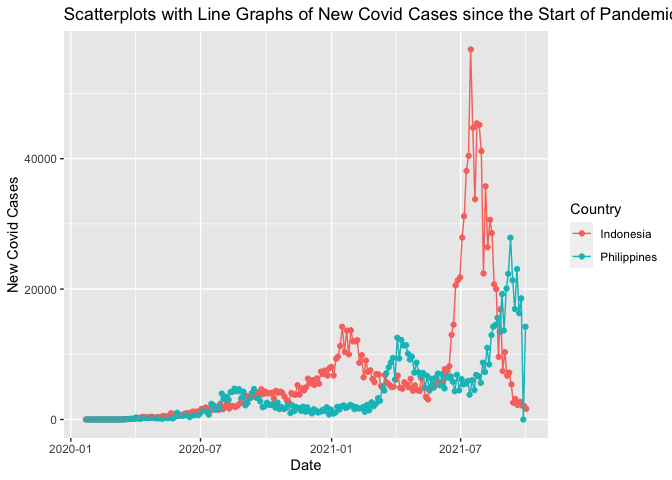<!-- -->

``` r
#barplot for new deaths
dataBarPlot <- dataset %>% filter(Year==2020, Month==10, Day==1)
ggplot(dataBarPlot, aes(Country, NewDeaths)) + geom_col(fill="red", alpha=0.5) + 
  labs(x="Country", y="Number of Deaths", title="Number of Deaths for October 1, 2021") +
    geom_text(aes(label=NewDeaths))
```

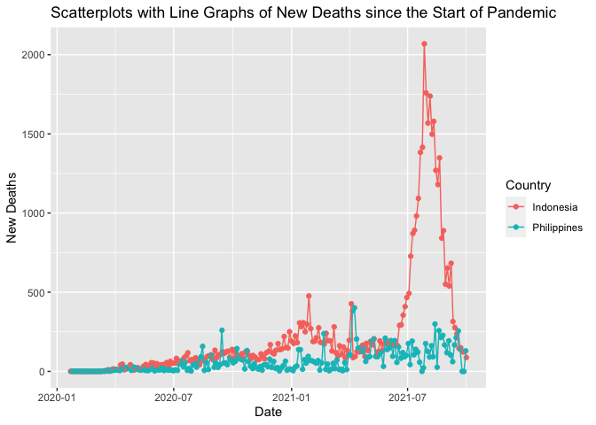<!-- -->

``` r
#barplot for active cases
dataBarPlot <- dataset %>% filter(Year==2020, Month==10, Day==1)
ggplot(dataBarPlot, aes(Country, Active)) + geom_col(fill="green", alpha=0.5) + 
  labs(x="Country", y="Active Cases", title="Active Covid Cases for October 1, 2021") +
    geom_text(aes(label=Active))
```

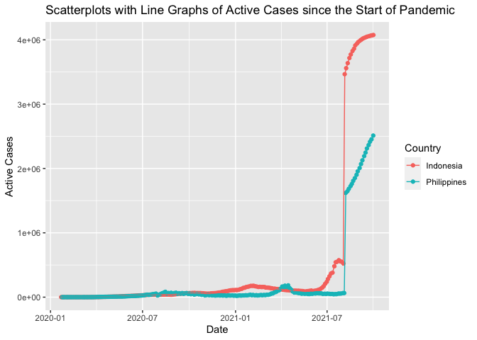<!-- -->

It can be seen from the barplots above that last October 1, 2021, the
Philippines consistently rank second for new cases and new deaths
recorded on that day while it went one rank lower in terms of the number
of active cases on that same day.

## Histograms

We will use histograms to summarize or provide a visual representation
of the distribution of our data. We will use `facet_wrap()` to place
histograms of the three countries in one plot. In the same manner, we
will use the three variables new cases, new deaths and active cases for
the month of September 2021.

``` r
#prepare dataset
dataHist <- dataset %>% filter(Year==2021, Month==9)

#daily new cases
ggplot(dataHist, aes(NewCases)) + geom_histogram(bins=17, color="black", fill="blue", alpha=0.5) +
  labs(x="New Cases", y="Counts", title="Histogram of Daily Cases for September 2021") +
    facet_wrap(~Country)
```

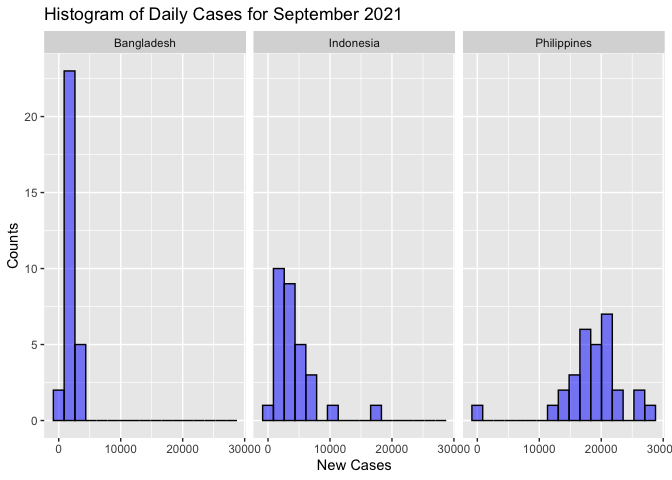<!-- -->

``` r
#new deaths
ggplot(dataHist, aes(NewDeaths)) + geom_histogram(bins=17, color="black", fill="red", alpha=0.5) +
  labs(x="New Deaths", y="Counts", title="Histogram of New Deaths for September 2021") +
    facet_wrap(~Country)
```

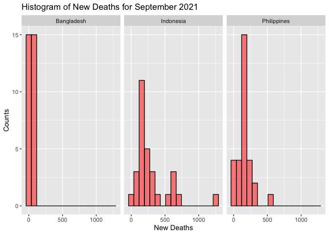<!-- -->

``` r
#active cases
ggplot(dataHist, aes(Active)) + geom_histogram(bins=20, color="black", fill="yellow", alpha=0.5) +
  labs(x="Active Cases", y="Counts", title="Histogram of Active Cases for September 2021") +
    facet_wrap(~Country)
```

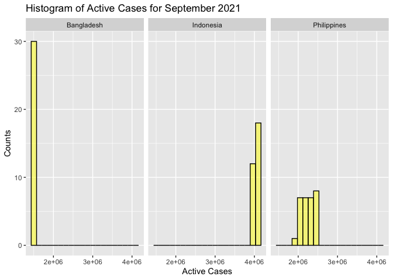<!-- --> The daily
cases histograms suggest that the Philippines’ September data is skewed
to the left which means that there are a number of days in September
where it records more Covid cases as compared to the other two
countries. On the other hand, the new deaths histogram show that
Indonesia and Philippines have similar distributions. Lastly, the active
cases histograms are not very meaningful because some countries failed
to submit their number of daily recoveries which aids in computing
active cases per day.

## Box plots

We will use box plots to show visually the distribution of our three
numerical data (new cases, new deaths and active cases) for the month of
September 2021 by using our data’s quantiles and averages.

``` r
#prepare data set
dataBoxPlot <- dataset %>% filter(Year==2021, Month==9)

#new cases box plots
ggplot(dataBoxPlot, aes(Country, NewCases)) + geom_boxplot(aes(colour=Country)) +
  labs(x="Country", y="Counts", title="Boxplots of New Covid Cases for September 2021") + 
    theme(legend.position="none")
```

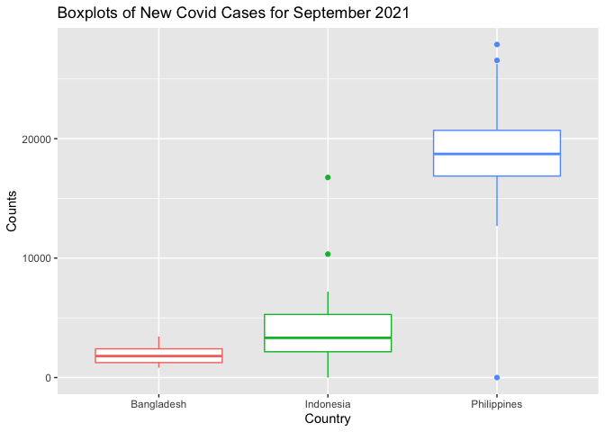<!-- -->

``` r
#new deaths box plots
ggplot(dataBoxPlot, aes(Country, NewDeaths)) + geom_boxplot(aes(colour=Country)) +
  labs(x="Country", y="Counts", title="Boxplots of New Deaths for September 2021") + 
    theme(legend.position="none") 
```

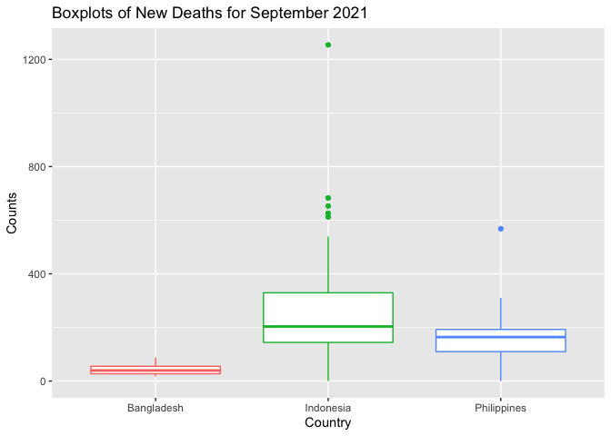<!-- -->

``` r
#active cases boxplots
ggplot(dataBoxPlot, aes(Country, Active)) + geom_boxplot(aes(colour=Country)) +
  labs(x="Country", y="Counts", title="Boxplots of Active Cases for September 2021") + 
    theme(legend.position="none")   
```

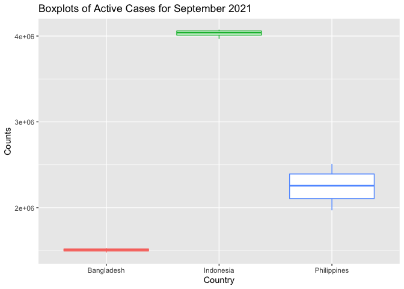<!-- --> The box plot
on new Covid cases suggest that the the Philippines recorded the highest
for the month of September. It is second in rank again for both number
new deaths and active cases in the same month. These box plots suggest
further that there is significant difference in terms of the
distributions of the data in each country.

## Scatterplots with Line Graphs

In these plots, we will use the ‘Date’ variable to easily plot trends
since the start of the pandemic. We will overlay line graphs to to our
scatter plots to help show trends of our data.

``` r
#New Cases
ggplot(dataset, aes(Date, NewCases)) + geom_jitter(aes(color=Country)) + 
  geom_line(aes(group=Country, color=Country)) +
    labs(x="Date", y="New Covid Cases", 
         title="Scatterplots with Line Graphs of New Covid Cases since the Start of Pandemic")
```

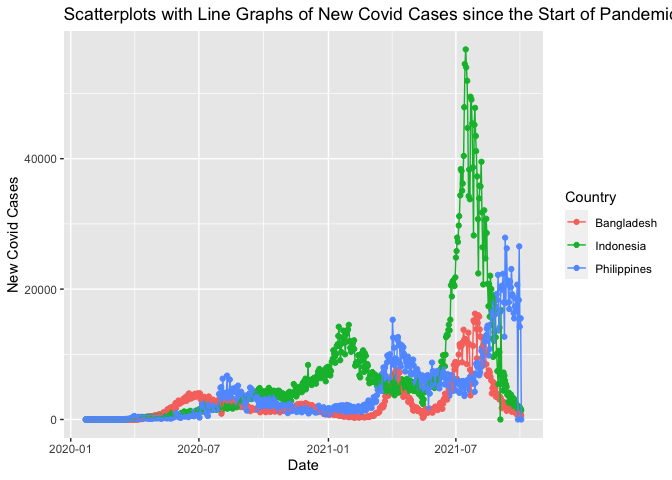<!-- -->

``` r
#New Deaths
ggplot(dataset, aes(Date, NewDeaths)) + geom_jitter(aes(color=Country)) + 
  geom_line(aes(group=Country, color=Country)) +
    labs(x="Date", y="New Deaths", 
         title="Scatterplots with Line Graphs of New Deaths since the Start of Pandemic")
```

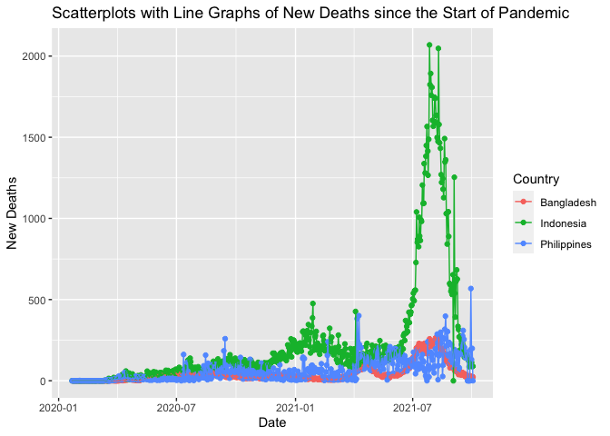<!-- -->

``` r
#Active Cases
ggplot(dataset, aes(Date, Active)) + geom_jitter(aes(color=Country)) + 
  geom_line(aes(group=Country, color=Country)) +
    labs(x="Date", y="Active Cases", 
         title="Scatterplots with Line Graphs of Active Cases since the Start of Pandemic")
```

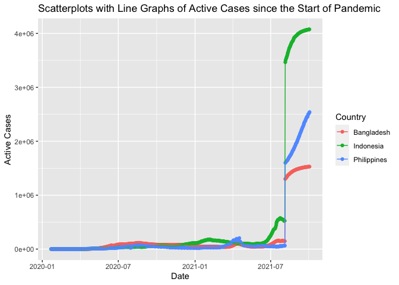<!-- --> The line
graphs of new Covid cases suggest that since the start of the pandemic,
the Philippines have experienced three waves of the spread of Covid-19.
It has consistently ranked second, next to Indonesia, for both new cases
and new deaths. The sudden jump of line graphs under active cases for
August 2021 is due to the different countries’ failure to submit reports
on the number of daily recoveries thus loosing track of current active
cases.

# Summary

Doing this project gave me mixed emotions. I enjoyed making this
vignette because the idea of working on real-time data and sharing
real-time analysis thrilled me. I find the whole process so cool and
relevant especially during this pandemic. But at the same it made me sad
knowing that my home country, the Philippines, is lagging behind in
terms of its effort of controlling the spread of the virus and
minimizing unnecessary loss of lives. On the brighter side, this project
gives me hope that there are ways to improve our fight against this
virus. One thing that the government can do is to look at, learn from
and imitate our neighboring countries’ strategies that work to mitigate
the spread of the virus. The fight is not over yet as long as we are
willing to learn from our mistakes and do our part.
