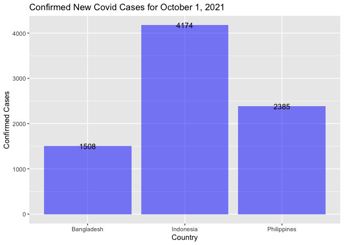
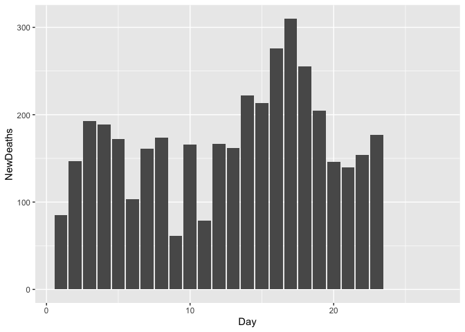

28 September, 2021

-   [Required Packages](#required-packages)
-   [Data Manipulation](#data-manipulation)

# Required Packages

In this project, we will use a number of amazing R packages:

-   `knitr`: to generate pretty tables of date using the `kable()`
    function.  
-   `tidyverse`: to manipulate data, generate plots (via `ggplot2`), and
    to use piping/chaining.
-   `rmarkdown`: to knit output files manually using the `render()`
    function.  
-   `jsonlite`: to pull data from various endpoints of the Covid 19
    APIs.

``` r
#helper function to generate a vector of countries and their corresponding Slug name whose data are update daily.

countryList <- function(){
  covid <- GET("https://api.covid19api.com/summary")
  covidDF <- fromJSON(rawToChar(covid$content))
  countryList <- covidDF$Countries %>% select(Country, Slug) %>% as_tibble()
  return(countryList)
}
  
countryList <- countryList()
kable(countryList)
```

| Country                         | Slug                             |
|:--------------------------------|:---------------------------------|
| Afghanistan                     | afghanistan                      |
| Albania                         | albania                          |
| Algeria                         | algeria                          |
| Andorra                         | andorra                          |
| Angola                          | angola                           |
| Antigua and Barbuda             | antigua-and-barbuda              |
| Argentina                       | argentina                        |
| Armenia                         | armenia                          |
| Australia                       | australia                        |
| Austria                         | austria                          |
| Azerbaijan                      | azerbaijan                       |
| Bahamas                         | bahamas                          |
| Bahrain                         | bahrain                          |
| Bangladesh                      | bangladesh                       |
| Barbados                        | barbados                         |
| Belarus                         | belarus                          |
| Belgium                         | belgium                          |
| Belize                          | belize                           |
| Benin                           | benin                            |
| Bhutan                          | bhutan                           |
| Bolivia                         | bolivia                          |
| Bosnia and Herzegovina          | bosnia-and-herzegovina           |
| Botswana                        | botswana                         |
| Brazil                          | brazil                           |
| Brunei Darussalam               | brunei                           |
| Bulgaria                        | bulgaria                         |
| Burkina Faso                    | burkina-faso                     |
| Burundi                         | burundi                          |
| Cambodia                        | cambodia                         |
| Cameroon                        | cameroon                         |
| Canada                          | canada                           |
| Cape Verde                      | cape-verde                       |
| Central African Republic        | central-african-republic         |
| Chad                            | chad                             |
| Chile                           | chile                            |
| China                           | china                            |
| Colombia                        | colombia                         |
| Comoros                         | comoros                          |
| Congo (Brazzaville)             | congo-brazzaville                |
| Congo (Kinshasa)                | congo-kinshasa                   |
| Costa Rica                      | costa-rica                       |
| Croatia                         | croatia                          |
| Cuba                            | cuba                             |
| Cyprus                          | cyprus                           |
| Czech Republic                  | czech-republic                   |
| Côte d’Ivoire                   | cote-divoire                     |
| Denmark                         | denmark                          |
| Djibouti                        | djibouti                         |
| Dominica                        | dominica                         |
| Dominican Republic              | dominican-republic               |
| Ecuador                         | ecuador                          |
| Egypt                           | egypt                            |
| El Salvador                     | el-salvador                      |
| Equatorial Guinea               | equatorial-guinea                |
| Eritrea                         | eritrea                          |
| Estonia                         | estonia                          |
| Ethiopia                        | ethiopia                         |
| Fiji                            | fiji                             |
| Finland                         | finland                          |
| France                          | france                           |
| Gabon                           | gabon                            |
| Gambia                          | gambia                           |
| Georgia                         | georgia                          |
| Germany                         | germany                          |
| Ghana                           | ghana                            |
| Greece                          | greece                           |
| Grenada                         | grenada                          |
| Guatemala                       | guatemala                        |
| Guinea                          | guinea                           |
| Guinea-Bissau                   | guinea-bissau                    |
| Guyana                          | guyana                           |
| Haiti                           | haiti                            |
| Holy See (Vatican City State)   | holy-see-vatican-city-state      |
| Honduras                        | honduras                         |
| Hungary                         | hungary                          |
| Iceland                         | iceland                          |
| India                           | india                            |
| Indonesia                       | indonesia                        |
| Iran, Islamic Republic of       | iran                             |
| Iraq                            | iraq                             |
| Ireland                         | ireland                          |
| Israel                          | israel                           |
| Italy                           | italy                            |
| Jamaica                         | jamaica                          |
| Japan                           | japan                            |
| Jordan                          | jordan                           |
| Kazakhstan                      | kazakhstan                       |
| Kenya                           | kenya                            |
| Kiribati                        | kiribati                         |
| Korea (South)                   | korea-south                      |
| Kuwait                          | kuwait                           |
| Kyrgyzstan                      | kyrgyzstan                       |
| Lao PDR                         | lao-pdr                          |
| Latvia                          | latvia                           |
| Lebanon                         | lebanon                          |
| Lesotho                         | lesotho                          |
| Liberia                         | liberia                          |
| Libya                           | libya                            |
| Liechtenstein                   | liechtenstein                    |
| Lithuania                       | lithuania                        |
| Luxembourg                      | luxembourg                       |
| Macedonia, Republic of          | macedonia                        |
| Madagascar                      | madagascar                       |
| Malawi                          | malawi                           |
| Malaysia                        | malaysia                         |
| Maldives                        | maldives                         |
| Mali                            | mali                             |
| Malta                           | malta                            |
| Marshall Islands                | marshall-islands                 |
| Mauritania                      | mauritania                       |
| Mauritius                       | mauritius                        |
| Mexico                          | mexico                           |
| Micronesia, Federated States of | micronesia                       |
| Moldova                         | moldova                          |
| Monaco                          | monaco                           |
| Mongolia                        | mongolia                         |
| Montenegro                      | montenegro                       |
| Morocco                         | morocco                          |
| Mozambique                      | mozambique                       |
| Myanmar                         | myanmar                          |
| Namibia                         | namibia                          |
| Nepal                           | nepal                            |
| Netherlands                     | netherlands                      |
| New Zealand                     | new-zealand                      |
| Nicaragua                       | nicaragua                        |
| Niger                           | niger                            |
| Nigeria                         | nigeria                          |
| Norway                          | norway                           |
| Oman                            | oman                             |
| Pakistan                        | pakistan                         |
| Palau                           | palau                            |
| Palestinian Territory           | palestine                        |
| Panama                          | panama                           |
| Papua New Guinea                | papua-new-guinea                 |
| Paraguay                        | paraguay                         |
| Peru                            | peru                             |
| Philippines                     | philippines                      |
| Poland                          | poland                           |
| Portugal                        | portugal                         |
| Qatar                           | qatar                            |
| Republic of Kosovo              | kosovo                           |
| Romania                         | romania                          |
| Russian Federation              | russia                           |
| Rwanda                          | rwanda                           |
| Saint Kitts and Nevis           | saint-kitts-and-nevis            |
| Saint Lucia                     | saint-lucia                      |
| Saint Vincent and Grenadines    | saint-vincent-and-the-grenadines |
| Samoa                           | samoa                            |
| San Marino                      | san-marino                       |
| Sao Tome and Principe           | sao-tome-and-principe            |
| Saudi Arabia                    | saudi-arabia                     |
| Senegal                         | senegal                          |
| Serbia                          | serbia                           |
| Seychelles                      | seychelles                       |
| Sierra Leone                    | sierra-leone                     |
| Singapore                       | singapore                        |
| Slovakia                        | slovakia                         |
| Slovenia                        | slovenia                         |
| Solomon Islands                 | solomon-islands                  |
| Somalia                         | somalia                          |
| South Africa                    | south-africa                     |
| South Sudan                     | south-sudan                      |
| Spain                           | spain                            |
| Sri Lanka                       | sri-lanka                        |
| Sudan                           | sudan                            |
| Suriname                        | suriname                         |
| Swaziland                       | swaziland                        |
| Sweden                          | sweden                           |
| Switzerland                     | switzerland                      |
| Syrian Arab Republic (Syria)    | syria                            |
| Taiwan, Republic of China       | taiwan                           |
| Tajikistan                      | tajikistan                       |
| Tanzania, United Republic of    | tanzania                         |
| Thailand                        | thailand                         |
| Timor-Leste                     | timor-leste                      |
| Togo                            | togo                             |
| Trinidad and Tobago             | trinidad-and-tobago              |
| Tunisia                         | tunisia                          |
| Turkey                          | turkey                           |
| Uganda                          | uganda                           |
| Ukraine                         | ukraine                          |
| United Arab Emirates            | united-arab-emirates             |
| United Kingdom                  | united-kingdom                   |
| United States of America        | united-states                    |
| Uruguay                         | uruguay                          |
| Uzbekistan                      | uzbekistan                       |
| Vanuatu                         | vanuatu                          |
| Venezuela (Bolivarian Republic) | venezuela                        |
| Viet Nam                        | vietnam                          |
| Yemen                           | yemen                            |
| Zambia                          | zambia                           |
| Zimbabwe                        | zimbabwe                         |

``` r
#function to generate data of a particular country

countryData <- function(countrySlug){
  if (countrySlug %in% countryList$Slug){
      url <- paste0("https://api.covid19api.com/total/country/",countrySlug)
      covidData <- GET(url)
      covidDF <- fromJSON(rawToChar(covidData$content))
      dataTibble <- covidDF %>% as_tibble()
  } else {
    message <- paste("ERROR: Argument for country slug is not found.
                     Check the list of countries with its corresponding slug name
                     and use quotation marks.")
    stop(message)
  }
  return(dataTibble)
}

#now we can use the function to generate some data from five sample countries
covidInd <- countryData("indonesia")
covidBang <- countryData("bangladesh")
covidPhil <- countryData("philippines")
covidViet <- countryData("vietnam")
covidThai <- countryData("thailand")
```

# Data Manipulation

``` r
#we can create a function that will manipulate our data to prepare for data summaries and visualization
manipulateData <- function(dataset){
  dataset$Date <- as.Date(dataset$Date)
  dataset <- dataset %>% select(-c(CountryCode, Province, City, CityCode, Lat, Lon)) %>%
                  separate(Date, c("Year", "Month", "Day"), sep="-", convert=T, 
                     remove=F) %>% mutate("NewCases"=diff(c(0, Confirmed)),
                                          "NewDeaths"=diff(c(0, Deaths)))
  dataset$Country <- as.factor(dataset$Country)
  return(dataset)
}

#manipulate each dataset using the function above to prepare for summarization and visualization
covidInd <- manipulateData(covidInd)
covidBang <- manipulateData(covidBang)
covidPhil <- manipulateData(covidPhil)
covidViet <- manipulateData(covidViet)
covidThai <- manipulateData(covidThai)

#histogram
ggplot(covidPhil, aes(NewDeaths)) + geom_histogram()
```

    ## `stat_bin()` using `bins = 30`. Pick better value with `binwidth`.

<!-- -->

``` r
#barplot
dataBarPlot <- dataset %>% filter(Country=="Philippines", Year==2021, Month==9)
ggplot(dataBarPlot, aes(Day, NewDeaths)) + geom_col()
```

<!-- -->

``` r
#dataset <- bind_rows(covidBang, covidInd, covidPhil, covidThai, covidViet)


#datasetPlot <- dataset %>% filter(Country %in% c("Indonesia", "Philippines", "Vietnam"))


#ggplot(dataset, aes(Date,NewDeaths)) + geom_area(aes(fill=Country, alpha=0.5)) + geom_text(aes(label=NewDeaths))


#scatterplot
#dataBarPlot <- dataset %>% filter(Country %in% c("Philippines", "Thailand"), Year==2021, Month==9)
#ggplot(dataBarPlot, aes(Day, NewDeaths)) + geom_jitter(aes(color=Country))

#boxplot
#dataBoxPlot <- dataset %>% filter(Country %in% c("Philippines", "Thailand"), Year==2021, Month==9)

#ggplot(dataBoxPlot, aes(Country %in% c("Philippines", "Thailand"), NewDeaths)) + 
  #geom_boxplot(aes(colour=Country))
```

``` r
#covidInd <- covidInd %>% filter(Year == 2021 & Month == 09)

#ggplot(covidInd, aes(covidInd$Date, covidInd$NewCases)) + geom_col()

#ggplot(covidInd, aes(covidInd$Date, covidInd$NewDeaths)) + geom_col()
```

``` r
#get results of five countries to compare
compareCountries <- function(country1, country2, country3, country4, country5){
  covid <- GET("https://api.covid19api.com/summary")
  covidDF <- fromJSON(rawToChar(covid$content))
  data <- covidDF$Countries %>% as_tibble()
  #checks if first country supplied is in the data, misspelled or lack quotation marks
  if (country1 %in% data$Country){
    output1 <- data %>% filter(data$Country == country1) %>% select(-c(ID,Slug,Premium))
  }
  else{
    message <- paste("ERROR: Check spelling of first country or use quotation marks.")
    stop(message)
  }
  #checks if second country supplied is in the data, misspelled or lack quotation marks
  if (country2 %in% data$Country){
    output2 <- data %>% filter(data$Country == country2) %>% select(-c(ID,Slug, Premium))
  }
  else{
    message <- paste("ERROR: Check spelling of second country or use quotation marks.")
    stop(message)
  }
  #checks if third country supplied is in the data, misspelled or lack quotation marks
  if (country3 %in% data$Country){
  output3 <- data %>% filter(data$Country == country3) %>% select(-c(ID,Slug, Premium))
  }
  else{
    message <- paste("ERROR: Check spelling of third country or use quotation marks.")
    stop(message)
    }
  #checks if fourth country supplied is in the data, misspelled or lack quotation marks  
  if (country4 %in% data$Country){
  output4 <- data %>% filter(data$Country == country4) %>% select(-c(ID,Slug, Premium))
  }
  else{
    message <- paste("ERROR: Check spelling of fourth country or  use quotation marks.")
    stop(message)
  }
  #checks if fifth country supplied is in the data, misspelled or lack quotation marks  
  if (country5 %in% data$Country){
  output5 <- data %>% filter(data$Country == country5) %>% select(-c(ID, Slug, Premium))
  }
  else{
    message <- paste("ERROR: Check spelling of fifth country or use quotation marks.")
    stop(message)
  }
  output <- rbind(output1, output2, output3, output4, output5) %>% kable()
  return(output)
}

#check function if it works
compareCountries("Philippines","China", "Mexico", "United States of America", "Australia")
```

| Country                  | CountryCode | NewConfirmed | TotalConfirmed | NewDeaths | TotalDeaths | NewRecovered | TotalRecovered | Date                     |
|:-------------------------|:------------|-------------:|---------------:|----------:|------------:|-------------:|---------------:|:-------------------------|
| Philippines              | PH          |            0 |        2490858 |         0 |       37405 |            0 |              0 | 2021-09-29T00:03:19.855Z |
| China                    | CN          |           35 |         108344 |         0 |        4849 |            0 |              0 | 2021-09-29T00:03:19.855Z |
| Mexico                   | MX          |         3007 |        3635807 |       226 |      275676 |            0 |              0 | 2021-09-29T00:03:19.855Z |
| United States of America | US          |       185088 |       43116442 |      2394 |      690426 |            0 |              0 | 2021-09-29T00:03:19.855Z |
| Australia                | AU          |         1880 |         100911 |        11 |        1256 |            0 |              0 | 2021-09-29T00:03:19.855Z |
