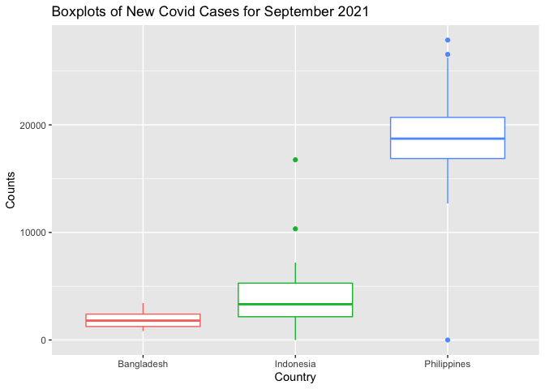
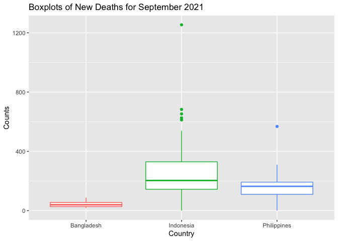

28 September, 2021

-   [Required Packages](#required-packages)
-   [Data Manipulation](#data-manipulation)

# Required Packages

In this project, we will use a number of amazing R packages:

-   `knitr`: to generate pretty tables of date using the `kable()`
    function.  
-   `tidyverse`: to manipulate data, generate plots (via `ggplot2`), and
    to use piping/chaining.
-   `rmarkdown`: to knit output files manually using the `render()`
    function.  
-   `jsonlite`: to pull data from various endpoints of the Covid 19
    APIs.

``` r
#helper function to generate a vector of countries and their corresponding Slug name whose data are update daily.

countryList <- function(){
  covid <- GET("https://api.covid19api.com/summary")
  covidDF <- fromJSON(rawToChar(covid$content))
  countryList <- covidDF$Countries %>% select(Country, Slug) %>% as_tibble()
  return(countryList)
}
  
countryList <- countryList()
kable(t(countryList))
```

|         |             |         |         |         |        |                     |           |         |           |         |            |         |         |            |          |         |         |        |       |        |         |                        |          |        |                   |          |              |         |          |          |        |            |                          |      |       |       |          |         |                     |                  |            |         |      |        |                |               |         |          |          |                    |         |       |             |                   |         |         |          |      |         |        |       |        |         |         |       |        |         |           |        |               |        |       |                               |          |         |         |       |           |                           |      |         |        |       |         |       |        |            |       |          |               |        |            |         |        |         |         |         |       |               |           |            |                        |            |        |          |          |      |       |                  |            |           |        |                                 |         |        |          |            |         |            |         |         |       |             |             |           |       |         |        |      |          |       |                       |        |                  |          |      |             |        |          |       |                    |         |                    |        |                       |             |                                  |       |            |                       |              |         |        |            |              |           |          |          |                 |         |              |             |       |           |       |          |           |        |             |                              |                           |            |                              |          |             |      |                     |         |        |        |         |                      |                |                          |         |            |         |                                 |          |       |        |          |
|:--------|:------------|:--------|:--------|:--------|:-------|:--------------------|:----------|:--------|:----------|:--------|:-----------|:--------|:--------|:-----------|:---------|:--------|:--------|:-------|:------|:-------|:--------|:-----------------------|:---------|:-------|:------------------|:---------|:-------------|:--------|:---------|:---------|:-------|:-----------|:-------------------------|:-----|:------|:------|:---------|:--------|:--------------------|:-----------------|:-----------|:--------|:-----|:-------|:---------------|:--------------|:--------|:---------|:---------|:-------------------|:--------|:------|:------------|:------------------|:--------|:--------|:---------|:-----|:--------|:-------|:------|:-------|:--------|:--------|:------|:-------|:--------|:----------|:-------|:--------------|:-------|:------|:------------------------------|:---------|:--------|:--------|:------|:----------|:--------------------------|:-----|:--------|:-------|:------|:--------|:------|:-------|:-----------|:------|:---------|:--------------|:-------|:-----------|:--------|:-------|:--------|:--------|:--------|:------|:--------------|:----------|:-----------|:-----------------------|:-----------|:-------|:---------|:---------|:-----|:------|:-----------------|:-----------|:----------|:-------|:--------------------------------|:--------|:-------|:---------|:-----------|:--------|:-----------|:--------|:--------|:------|:------------|:------------|:----------|:------|:--------|:-------|:-----|:---------|:------|:----------------------|:-------|:-----------------|:---------|:-----|:------------|:-------|:---------|:------|:-------------------|:--------|:-------------------|:-------|:----------------------|:------------|:---------------------------------|:------|:-----------|:----------------------|:-------------|:--------|:-------|:-----------|:-------------|:----------|:---------|:---------|:----------------|:--------|:-------------|:------------|:------|:----------|:------|:---------|:----------|:-------|:------------|:-----------------------------|:--------------------------|:-----------|:-----------------------------|:---------|:------------|:-----|:--------------------|:--------|:-------|:-------|:--------|:---------------------|:---------------|:-------------------------|:--------|:-----------|:--------|:--------------------------------|:---------|:------|:-------|:---------|
| Country | Afghanistan | Albania | Algeria | Andorra | Angola | Antigua and Barbuda | Argentina | Armenia | Australia | Austria | Azerbaijan | Bahamas | Bahrain | Bangladesh | Barbados | Belarus | Belgium | Belize | Benin | Bhutan | Bolivia | Bosnia and Herzegovina | Botswana | Brazil | Brunei Darussalam | Bulgaria | Burkina Faso | Burundi | Cambodia | Cameroon | Canada | Cape Verde | Central African Republic | Chad | Chile | China | Colombia | Comoros | Congo (Brazzaville) | Congo (Kinshasa) | Costa Rica | Croatia | Cuba | Cyprus | Czech Republic | Côte d’Ivoire | Denmark | Djibouti | Dominica | Dominican Republic | Ecuador | Egypt | El Salvador | Equatorial Guinea | Eritrea | Estonia | Ethiopia | Fiji | Finland | France | Gabon | Gambia | Georgia | Germany | Ghana | Greece | Grenada | Guatemala | Guinea | Guinea-Bissau | Guyana | Haiti | Holy See (Vatican City State) | Honduras | Hungary | Iceland | India | Indonesia | Iran, Islamic Republic of | Iraq | Ireland | Israel | Italy | Jamaica | Japan | Jordan | Kazakhstan | Kenya | Kiribati | Korea (South) | Kuwait | Kyrgyzstan | Lao PDR | Latvia | Lebanon | Lesotho | Liberia | Libya | Liechtenstein | Lithuania | Luxembourg | Macedonia, Republic of | Madagascar | Malawi | Malaysia | Maldives | Mali | Malta | Marshall Islands | Mauritania | Mauritius | Mexico | Micronesia, Federated States of | Moldova | Monaco | Mongolia | Montenegro | Morocco | Mozambique | Myanmar | Namibia | Nepal | Netherlands | New Zealand | Nicaragua | Niger | Nigeria | Norway | Oman | Pakistan | Palau | Palestinian Territory | Panama | Papua New Guinea | Paraguay | Peru | Philippines | Poland | Portugal | Qatar | Republic of Kosovo | Romania | Russian Federation | Rwanda | Saint Kitts and Nevis | Saint Lucia | Saint Vincent and Grenadines     | Samoa | San Marino | Sao Tome and Principe | Saudi Arabia | Senegal | Serbia | Seychelles | Sierra Leone | Singapore | Slovakia | Slovenia | Solomon Islands | Somalia | South Africa | South Sudan | Spain | Sri Lanka | Sudan | Suriname | Swaziland | Sweden | Switzerland | Syrian Arab Republic (Syria) | Taiwan, Republic of China | Tajikistan | Tanzania, United Republic of | Thailand | Timor-Leste | Togo | Trinidad and Tobago | Tunisia | Turkey | Uganda | Ukraine | United Arab Emirates | United Kingdom | United States of America | Uruguay | Uzbekistan | Vanuatu | Venezuela (Bolivarian Republic) | Viet Nam | Yemen | Zambia | Zimbabwe |
| Slug    | afghanistan | albania | algeria | andorra | angola | antigua-and-barbuda | argentina | armenia | australia | austria | azerbaijan | bahamas | bahrain | bangladesh | barbados | belarus | belgium | belize | benin | bhutan | bolivia | bosnia-and-herzegovina | botswana | brazil | brunei            | bulgaria | burkina-faso | burundi | cambodia | cameroon | canada | cape-verde | central-african-republic | chad | chile | china | colombia | comoros | congo-brazzaville   | congo-kinshasa   | costa-rica | croatia | cuba | cyprus | czech-republic | cote-divoire  | denmark | djibouti | dominica | dominican-republic | ecuador | egypt | el-salvador | equatorial-guinea | eritrea | estonia | ethiopia | fiji | finland | france | gabon | gambia | georgia | germany | ghana | greece | grenada | guatemala | guinea | guinea-bissau | guyana | haiti | holy-see-vatican-city-state   | honduras | hungary | iceland | india | indonesia | iran                      | iraq | ireland | israel | italy | jamaica | japan | jordan | kazakhstan | kenya | kiribati | korea-south   | kuwait | kyrgyzstan | lao-pdr | latvia | lebanon | lesotho | liberia | libya | liechtenstein | lithuania | luxembourg | macedonia              | madagascar | malawi | malaysia | maldives | mali | malta | marshall-islands | mauritania | mauritius | mexico | micronesia                      | moldova | monaco | mongolia | montenegro | morocco | mozambique | myanmar | namibia | nepal | netherlands | new-zealand | nicaragua | niger | nigeria | norway | oman | pakistan | palau | palestine             | panama | papua-new-guinea | paraguay | peru | philippines | poland | portugal | qatar | kosovo             | romania | russia             | rwanda | saint-kitts-and-nevis | saint-lucia | saint-vincent-and-the-grenadines | samoa | san-marino | sao-tome-and-principe | saudi-arabia | senegal | serbia | seychelles | sierra-leone | singapore | slovakia | slovenia | solomon-islands | somalia | south-africa | south-sudan | spain | sri-lanka | sudan | suriname | swaziland | sweden | switzerland | syria                        | taiwan                    | tajikistan | tanzania                     | thailand | timor-leste | togo | trinidad-and-tobago | tunisia | turkey | uganda | ukraine | united-arab-emirates | united-kingdom | united-states            | uruguay | uzbekistan | vanuatu | venezuela                       | vietnam  | yemen | zambia | zimbabwe |

``` r
#function to generate data of a particular country

countryData <- function(countrySlug){
  if (countrySlug %in% countryList$Slug){
      url <- paste0("https://api.covid19api.com/total/country/",countrySlug)
      covidData <- GET(url)
      covidDF <- fromJSON(rawToChar(covidData$content))
      dataTibble <- covidDF %>% as_tibble()
  } else {
    message <- paste("ERROR: Argument for country slug is not found.
                     Check the list of countries with its corresponding slug name
                     and use quotation marks.")
    stop(message)
  }
  return(dataTibble)
}

#now we can use the function to generate some data from five sample countries
covidInd <- countryData("indonesia")
covidBang <- countryData("bangladesh")
covidPhil <- countryData("philippines")
covidViet <- countryData("vietnam")
covidThai <- countryData("thailand")
```

# Data Manipulation

``` r
#we can create a function that will manipulate our data to prepare for data summaries and visualization
manipulateData <- function(dataset){
  dataset$Date <- as.Date(dataset$Date)
  dataset <- dataset %>% select(-c(CountryCode, Province, City, CityCode, Lat, Lon)) %>%
                  separate(Date, c("Year", "Month", "Day"), sep="-", convert=T, 
                     remove=F) %>% mutate("NewCases"=diff(c(0, Confirmed)),
                                          "NewDeaths"=diff(c(0, Deaths)))
  dataset$Country <- as.factor(dataset$Country)
  return(dataset)
}

#manipulate each dataset using the function above to prepare for summarization and visualization
covidInd <- manipulateData(covidInd)
covidBang <- manipulateData(covidBang)
covidPhil <- manipulateData(covidPhil)
covidViet <- manipulateData(covidViet)
covidThai <- manipulateData(covidThai)

#histogram
ggplot(covidPhil, aes(NewDeaths)) + geom_histogram()
```

    ## `stat_bin()` using `bins = 30`. Pick better value with `binwidth`.

<!-- -->

``` r
#barplot
dataBarPlot <- dataset %>% filter(Country=="Philippines", Year==2021, Month==9)
ggplot(dataBarPlot, aes(Day, NewDeaths)) + geom_col()
```

<!-- -->

``` r
#dataset <- bind_rows(covidBang, covidInd, covidPhil, covidThai, covidViet)


#datasetPlot <- dataset %>% filter(Country %in% c("Indonesia", "Philippines", "Vietnam"))


#ggplot(dataset, aes(Date,NewDeaths)) + geom_area(aes(fill=Country, alpha=0.5)) + geom_text(aes(label=NewDeaths))


#scatterplot
#dataBarPlot <- dataset %>% filter(Country %in% c("Philippines", "Thailand"), Year==2021, Month==9)
#ggplot(dataBarPlot, aes(Day, NewDeaths)) + geom_jitter(aes(color=Country))

#boxplot
#dataBoxPlot <- dataset %>% filter(Country %in% c("Philippines", "Thailand"), Year==2021, Month==9)

#ggplot(dataBoxPlot, aes(Country %in% c("Philippines", "Thailand"), NewDeaths)) + 
  #geom_boxplot(aes(colour=Country))
```

``` r
#covidInd <- covidInd %>% filter(Year == 2021 & Month == 09)

#ggplot(covidInd, aes(covidInd$Date, covidInd$NewCases)) + geom_col()

#ggplot(covidInd, aes(covidInd$Date, covidInd$NewDeaths)) + geom_col()
```

``` r
#get results of five countries to compare
compareCountries <- function(country1, country2, country3, country4, country5){
  covid <- GET("https://api.covid19api.com/summary")
  covidDF <- fromJSON(rawToChar(covid$content))
  data <- covidDF$Countries %>% as_tibble()
  #checks if first country supplied is in the data, misspelled or lack quotation marks
  if (country1 %in% data$Country){
    output1 <- data %>% filter(data$Country == country1) %>% select(-c(ID,Slug,Premium))
  }
  else{
    message <- paste("ERROR: Check spelling of first country or use quotation marks.")
    stop(message)
  }
  #checks if second country supplied is in the data, misspelled or lack quotation marks
  if (country2 %in% data$Country){
    output2 <- data %>% filter(data$Country == country2) %>% select(-c(ID,Slug, Premium))
  }
  else{
    message <- paste("ERROR: Check spelling of second country or use quotation marks.")
    stop(message)
  }
  #checks if third country supplied is in the data, misspelled or lack quotation marks
  if (country3 %in% data$Country){
  output3 <- data %>% filter(data$Country == country3) %>% select(-c(ID,Slug, Premium))
  }
  else{
    message <- paste("ERROR: Check spelling of third country or use quotation marks.")
    stop(message)
    }
  #checks if fourth country supplied is in the data, misspelled or lack quotation marks  
  if (country4 %in% data$Country){
  output4 <- data %>% filter(data$Country == country4) %>% select(-c(ID,Slug, Premium))
  }
  else{
    message <- paste("ERROR: Check spelling of fourth country or  use quotation marks.")
    stop(message)
  }
  #checks if fifth country supplied is in the data, misspelled or lack quotation marks  
  if (country5 %in% data$Country){
  output5 <- data %>% filter(data$Country == country5) %>% select(-c(ID, Slug, Premium))
  }
  else{
    message <- paste("ERROR: Check spelling of fifth country or use quotation marks.")
    stop(message)
  }
  output <- rbind(output1, output2, output3, output4, output5) %>% kable()
  return(output)
}

#check function if it works
compareCountries("Philippines","China", "Mexico", "United States of America", "Australia")
```

| Country                  | CountryCode | NewConfirmed | TotalConfirmed | NewDeaths | TotalDeaths | NewRecovered | TotalRecovered | Date                     |
|:-------------------------|:------------|-------------:|---------------:|----------:|------------:|-------------:|---------------:|:-------------------------|
| Philippines              | PH          |            0 |        2490858 |         0 |       37405 |            0 |              0 | 2021-09-29T00:03:19.855Z |
| China                    | CN          |           35 |         108344 |         0 |        4849 |            0 |              0 | 2021-09-29T00:03:19.855Z |
| Mexico                   | MX          |         3007 |        3635807 |       226 |      275676 |            0 |              0 | 2021-09-29T00:03:19.855Z |
| United States of America | US          |       185088 |       43116442 |      2394 |      690426 |            0 |              0 | 2021-09-29T00:03:19.855Z |
| Australia                | AU          |         1880 |         100911 |        11 |        1256 |            0 |              0 | 2021-09-29T00:03:19.855Z |
